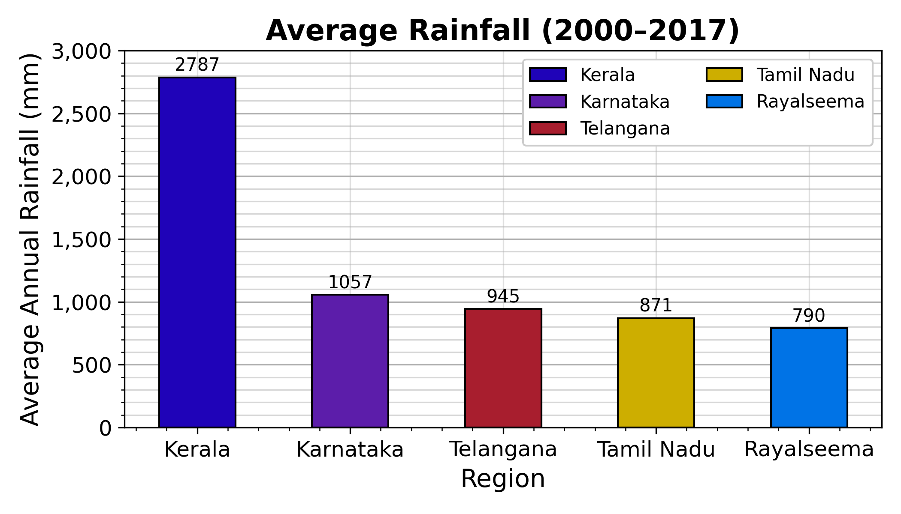

# 📊 Data Science Visualizations

A collection of plots and insights generated from my research work and experiments.

---

### 🔹 Visualization 1: Distribution of Research Paper Citations

### 🔹 Visualization 2: Model Accuracy Comparison

### 🔹 Visualization 3: Network Latency Heatmap

---

> All plots are generated using **Matplotlib** and **Seaborn** in Python.

